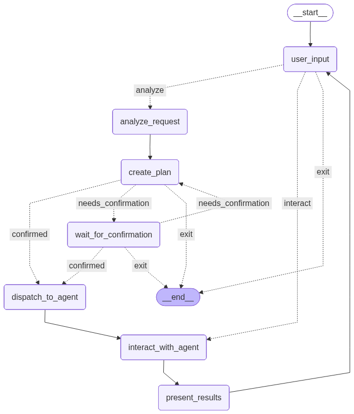

# MyAgent - Multi-Agent AI System

A powerful interactive AI agent system built with LangGraph, LangChain, and Ollama/OpenAI APIs. This project provides a terminal-based AI agent with local utility tools and support for remote MCP (Model Context Protocol) servers.



## 🌟 Key Features

- **Multi-Agent Architecture**: Includes orchestrator, coder, and file manager agents that automatically select the appropriate agent based on task type
- **Interactive Agent**: State-driven workflow that processes user input, generates model responses, and executes tools
- **Multiple Model Support**: Choose between local Ollama models or cloud-based OpenAI-compatible APIs
- **Rich Terminal UI**: Beautiful console interface with Markdown rendering and syntax highlighting
- **Local Tools**: File operations, document reading, PDF processing, and unit test execution
- **MCP Integration**: Support for remote MCP servers including Desktop Commander, Python sandbox, DuckDuckGo search, and GitHub
- **Persistent Memory**: SQLite-based checkpoint system for conversation continuity
- **Workflow Visualization**: Automatic generation of Mermaid diagrams for the agent's workflow

## 🚀 Quick Start

### Prerequisites

- Python 3.11 or higher
- uv (Python package manager)
- Docker (for MCP Docker images)
- Ollama (for local models) or API keys for cloud services

### Installation

1. **Clone the repository**
   ```bash
   git clone <repository-url>
   cd MyAgent
   ```

2. **Initialize the uv workspace**
   ```bash
   uv init
   ```

3. **Install dependencies**
   ```bash
   uv add -r requirements.txt
   ```

4. **Sync the environment**
   ```bash
   uv sync
   ```

5. **Activate the virtual environment**
   ```bash
   # Windows
   .\.venv\Scripts\activate
   
   # macOS/Linux
   source .venv/bin/activate
   ```

### Configuration

Create a `.env` file in the project root:

```env
# For Ollama (local models)
OLLAMA_BASE_URL=http://localhost:11434
OLLAMA_MODEL=llama3.1:8b

# For Cloud API (OpenAI-compatible)
OPENAI_API_BASE=https://api.openai.com/v1
OPENAI_API_KEY=your_api_key_here
OPENAI_MODEL=gpt-4

# For GitHub MCP integration
GITHUB_PERSONAL_ACCESS_TOKEN=ghp_your_token_here
```

### Running the Agents

#### Base Agent
```bash
# Using uv
uv run main.py

# Or with Python directly (after activating venv)
python main.py
```

#### Orchestrator Agent (Recommended)
```bash
# Using uv
uv run orchestrator_main.py

# Or with Python directly (after activating venv)
python orchestrator_main.py
```

#### Coder Agent
```bash
# Using uv
uv run coder_main.py

# Or with Python directly (after activating venv)
python coder_main.py
```

## 🛠️ Agent Types

### 1. Orchestrator Agent

This is the top-level orchestrator agent that automatically selects and calls appropriate sub-agents to complete tasks based on user needs.

**Features**:
- Analyzes user request types
- Automatically selects appropriate sub-agents
- Coordinates work between multiple agents

**Use Cases**:
- When unsure which specialized agent to use
- For comprehensive processing of multiple task types

### 2. Coder Agent

Specializes in handling programming and software development related tasks.

**Features**:
- Write and analyze code
- Debug and test
- Code optimization and refactoring
- Execute code
- Software architecture issues

**Use Cases**:
- "Please help me write a Python function to calculate the Fibonacci sequence"
- "Analyze performance issues in this code"
- "Write unit tests for this project"

### 3. File Manager Agent

Specializes in handling file and document management related tasks.

**Features**:
- Search files and directories
- Read file contents
- Write and create files
- Manage file system
- Document analysis

**Use Cases**:
- "Please help me find all .txt files in the current directory"
- "Read and summarize the content of this PDF document"
- "Create a project directory structure"

## 🛠️ Available Tools

### Local Tools

The system includes a comprehensive set of local tools for various tasks:

#### File Operations
- **file_read_tool**: Read text files with encoding support
- **list_filename_tool**: List files and directories with filtering options
- **write_txt_tool**: Write content to text files with timestamp support

#### Document Processing
- **doc_read_tool**: Read Microsoft Word documents (.docx) including text and table content
- **pdf_read_tool**: Extract text from PDF files using PyPDF2 or pdfplumber

#### Code Development
- **code_analyzer_tool**: Analyze code for quality issues, bugs, security vulnerabilities, and performance problems
- **code_execution_tool**: Execute code snippets in multiple languages (Python, JavaScript, Java, C++, Bash)
- **code_search_tool**: Search for code patterns, functions, classes, or text within code files
- **code_test_tool**: Run tests using various frameworks (pytest, unittest, jest, mocha, junit)
- **code_writer_tool**: Write or modify code files with proper formatting and documentation
- **run_unit_tests_tool**: Execute unit tests using uv command with pytest

#### System Operations
- **run_command_tool**: Execute shell commands with timeout and working directory options

### MCP Integrations

- **Desktop Commander**: File system operations and desktop automation
- **Python Sandbox**: Secure code execution environment
- **DuckDuckGo Search**: Web search capabilities
- **GitHub MCP**: Repository management and operations

## 📖 Usage Examples

Try these prompts to explore the agents' capabilities:

### Orchestrator Agent Examples
- "Help me analyze this project's code structure and generate documentation"
- "Create a Python project including setup files and basic functionality"
- "Search for all test files in this project and run tests"

### Coder Agent Examples
- "Write a Python script to process CSV data"
- "Optimize the performance of this code"
- "Write unit tests for this function"

### File Manager Agent Examples
- "Find all configuration files in the project"
- "Read requirements.txt and analyze dependencies"
- "Create a standard project directory structure"

## 🏗️ Architecture

The agent system uses a state graph architecture with the following components:

1. **Orchestration Layer**: Analyzes user requests and selects appropriate agents
2. **Agent Layer**: Specialized agents handle specific types of tasks
3. **Tool Layer**: Local tools and MCP server integrations
4. **Checkpoint System**: Saves conversation state for continuity

## 🔧 Development

### Building MCP Docker Images

```bash
# Build the Deno MCP Docker image
docker build -t deno-docker:latest -f ./mcps/deno/Dockerfile .
```

### Running the GitHub MCP Server

```bash
docker run -i --rm -e GITHUB_PERSONAL_ACCESS_TOKEN=your_token ghcr.io/github/github-mcp-server
```

### Inspecting the Database

The project uses SQLite to store checkpoints:

```bash
sqlite3 checkpoints.db

# List all tables
.tables

# Show table schema
.schema checkpoints

# Export query results
.mode csv
.output results.csv
.headers on
SELECT * FROM checkpoints;
.output stdout
```

## 🐛 Troubleshooting

### Common Issues

1. **uv command fails**
   - Ensure you've run `uv init` and `uv add -r requirements.txt`
   - Verify the virtual environment is activated

2. **Ollama connection issues**
   - Check that Ollama is running: `ollama list`
   - Verify the model specified in `.env` is downloaded

3. **Docker errors**
   - Confirm Docker Desktop is running
   - Check Docker permissions

4. **Python version mismatch**
   - Use the Python version your virtual environment was created with
   - Recreate the virtual environment if needed

5. **Model response errors**
   - Check your API keys in the `.env` file
   - Verify the model name matches what's available

### Debug Mode

For detailed debugging, you can modify the agent initialization in `agent.py` to enable verbose logging.

## 📄 License

This project is licensed under the MIT License - see the [LICENSE](LICENSE) file for details.

## 🔒 Security Considerations

- The agent reads files but does not execute arbitrary shell commands
- Review tools before trusting them with sensitive directories
- API keys should be stored securely in environment variables
- MCP servers run in isolated environments when possible

## 🤝 Contributing

Contributions are welcome! Please feel free to submit a Pull Request.

## 📞 Support

If you encounter any issues or have questions, please open an issue on the repository.

---